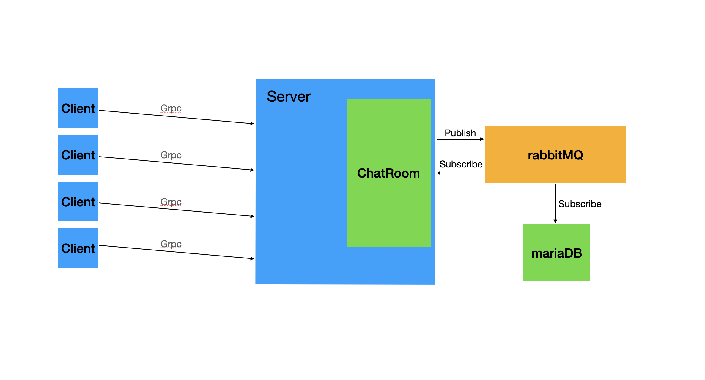

# simple-chat
使用grpc做通信的简单聊天室，消息处理基于rabbitmq， 数据库持久化基于mariadb
## 架构

## API
总共四个grpc接口，[接口定义](message/message.proto)：
1. Login: 处理用户名登录，检测当前用户名是否已经登录，保证用户名的唯一性
2. GetUserList: 获取所用用户，包括用户的登录状态
3. GetLatestHistoryMsg: 获取所有历史消息，包括当前用户的私聊消息
4. Chat：grpc streaming 的长链接接口，实时发送消息和接收消息
## 客户端逻辑
+ 客户端调用Login接口校验用户名。
+ 登录成功后，打开聊天室界面，并调用GetUserList,GetLatestHistoryMsg获取所用用户列表和历史（离线）消息。
+ 调用Chat接口启用长连接实时开启聊天。
## 服务端逻辑
+ Login接口 接收到用户名后检查当前用户名的状态，如果用户已登录则返回错误，
如未登录用户则修改用户状态为登录，如未注册则注册用户并保存用户信息到数据库。
+ Chat接口  接收到用户的调用以后，将当前链接保存到。根据消息的类型，将消息发布的不同的消息队列中。
消息队列将得到的消息对象通过与客户端使用 streaming 方法的长连接推送给客户端。
同时，每一个消息都发布到日志队列，将消息持久化到数据库。
+ GetUserList接口 查询用户map中所有的用户信息返回。
+ GetLatestHistoryMsg接口 根据当前用户名从数据库中查询出属于该用户的私聊消息，并查询出指定时间段的所有公共消息，一起返回给客户端。
## server
onserver 默认监听端口：`123456` 对外提供服务
## Makefile 启动服务
编译程序,编译客户端，服务端

要求：
- 服务器必须已经安装docker以及docker-compose，[如未安装，请自行安装]
- golang 版本必须支持 go mod

```bash
$ make build
```
准备开发环境：启动rabbitmq，mariadb启动和初始化
```bash
$ make prepare
```
单元测试和基准测试
```bash
$ make test
```
运行docker服务端
```bash
$ make run_server
```
运行本地客户端
```bash
$ make run_client
```
